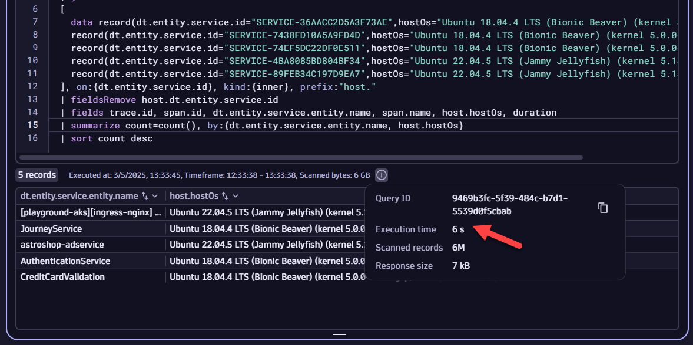
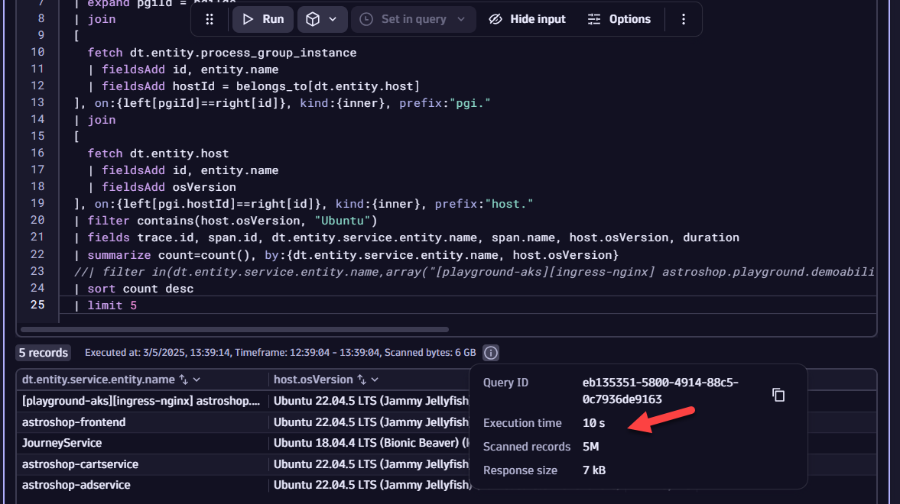

## Adding Data with `data` and `append` 

### Import Notebook into Dynatrace

[Notebook](https://github.com/jwood1985/enablement-dql301/blob/main/assets/json/DQL%20301%20-%20WWSE%20Professors%20Enablement.json)

### Including Raw Data with `data`
The `data` command provides an easy way to add any data you care about into a Notebook, Dashboard, Workflow, or any other component that uses DQL. This is most useful when pulling in data from other sources (i.e., Excel, CSV, etc.) or consolidating data from another query into a DQL statement. 

Syntax:
```
data record(key=value1),
record(key=value2,key2=value3), ...
```

For example, let's say your customer has a product name on all their key applications, placed as tag metadata on those entities in Dynatrace. This value, `DT_RELEASE_PRODUCT`, does not change often; the customer only adds new apps every 6 months. Therefore, if we use a query to return those `DT_RELEASE_PRODUCT` values, we can then build them as a new `data` array for subsequent queries without having to have to run a DQL `fetch`.

Extract the tags as a string for all of the process group instances (PGIs) in the environment, and parse out the `DT_RELEASE_PRODUCT` values.
```
fetch dt.entity.process_group_instance
| fieldsAdd tags
| fieldsAdd tagsToString = toString(tags)
| parse tagsToString, """DATA 'DT_RELEASE_PRODUCT:' LD:productName '\",' DATA EOF"""
| filter isNotNull(productName)
| summarize count=count(), by:{productName}
```

Your customer then tells you that they have different business units and business criticality values based on what application / product is in use. Those business units and criticality values are outlined in the table below.

Product Name | Business Unit | Criticality
--- | --- | ---
EasyTrade | Financial Services | HI
EasyTravel | Retail | HI
HipsterShop | Retail | LO

Let's build out the `data` array to include `productName`, `businessUnit`, and `criticality` record values accordingly:
```
data record(productName="easytrade",businessUnit="Financial Services",criticality="HI"),
record(productName="easytravel",businessUnit="Retail",criticality="HI"),
record(productName="hipstershop",businessUnit="Retail",criticality="LO")
```

You can now associate these new fields for `businessUnit` and `criticality` to any other entity that has the `productName` tag attached to it. 

To improve query performance, you can run a query once to get the fields you care about and then reuse that static or quasi-static field in other queries. Say you want to understand your application requests from the perspective of what OS version their underlying compute is running (Amazon Linux, Ubuntu Bionic Beaver, etc.). You want to know this because you are trying to plan for patching cycles and how you will maintain those systems for different, high-throughput apps. You know that these OS versions are LTS, and therefore constant. 

Let's look at the query which would gather those OS versions:

```
fetch spans, from:now()-1h, to:now() 
| fieldsAdd dt.entity.service
| fieldsAdd dt.entity.service.id = entityAttr(dt.entity.service,"id")
| fieldsAdd dt.entity.service.entity.name = entityName(dt.entity.service)
| fieldsAdd pgiRunsOn = entityAttr(dt.entity.service,"runs_on")
| fieldsAdd pgiIds = pgiRunsOn[dt.entity.process_group_instance]
| expand pgiId = pgiIds
| join
[
  fetch dt.entity.process_group_instance
  | fieldsAdd id, entity.name
  | fieldsAdd hostId = belongs_to[dt.entity.host]
], on:{left[pgiId]==right[id]}, kind:{inner}, prefix:"pgi."
| join
[
  fetch dt.entity.host
  | fieldsAdd id, entity.name
  | fieldsAdd osVersion
], on:{left[pgi.hostId]==right[id]}, kind:{inner}, prefix:"host."
| fields dt.entity.service.entity.name, dt.entity.service.id, host.entity.name, host.osVersion
| filter contains(host.osVersion, "Ubuntu")
| summarize count=countDistinct(host.osVersion), by:{host.osVersion,dt.entity.service.id}
| fieldsAdd dataRecord = concat("record(dt.entity.service.id=\"",dt.entity.service.id,"\",hostOs=\"",host.osVersion,"\"),")
| limit 10
```

**⏩ Try it out**: Now, see if you can take the column `dataRecord` and copy it into another query after the `// ADD QUERY HERE` line. Run that query and the subsequent one without the `data` record. Note the differences in performance.  

Snippet:
```
fetch spans, from:now()-1h, to:now() 
| fieldsAdd dt.entity.service
| fieldsAdd dt.entity.service.id = entityAttr(dt.entity.service,"id")
| fieldsAdd dt.entity.service.entity.name = entityName(dt.entity.service)
| join
[ 
// ADD QUERY HERE

], on:{dt.entity.service.id}, kind:{inner}, prefix:"host."
| fieldsRemove host.dt.entity.service.id
| fields trace.id, span.id, dt.entity.service.entity.name, span.name, host.hostOs, duration
| summarize count=count(), by:{dt.entity.service.entity.name, host.hostOs}
| sort count desc
```
In the screenshots below, you can clearly see the difference in performance with `data` and without it.

With `data`:


Without `data`:


The ability to add data on demand - particularly for non-DQL data sources and for quasi-static, long-running DQL queries - is a powerful way to add data into your DQL statements.

### Raw JSON Data Types with `data`
The `data` [command](https://docs.dynatrace.com/docs/discover-dynatrace/references/dynatrace-query-language/commands/data-source-commands#data) allows you to also pull in raw JSON content. 

The following is an example for nested JSON:
```
data json:"""[
  {
    "dataRecord": {
      "name": "jwoo1",
      "depositAmount": 112,
      "bankAccountId": 1234,
      "properties":
      {
        "type": "savings",
        "interestRate": 0.0045,
        "relatedAccounts":
        {
          "savings": "N/A",
          "checking": "2341",
          "mmf": "1493"
        }
      }
    }
  },
  {
    "dataRecord": {
      "name": "jdoe2",
      "depositAmount": 343,
      "bankAccountId": 1120,
      "properties":
      {
        "type": "checking",
        "interestRate": 0.00325,
        "relatedAccounts":
        {
          "savings": "3001",
          "checking": "N/A",
          "mmf": "8843"
        }
      }
    }
  },
  {
    "dataRecord": {
      "name": "jdoe3",
      "depositAmount": 8433,
      "bankAccountId": 1555
    }
  },
  {
    "dataRecord": {
      "name": "batman4",
      "depositAmount": 8433413,
      "bankAccountId": 1000,
      "properties":
      {
        "type": "savings",
        "interestRate": 0.0055,
        "relatedAccounts":
        {
          "savings": "N/A",
          "checking": "3499",
          "mmf": "2224"
        }
      }
    }
  }
]"""
```

**⏩ Try it out**: For that example, copy the `data` record into your Notebook and determine the median deposit amount (`depositAmount`) from the data. 

Nested JSON like the example in the `data` record can be more easily parsed if flatted accordingly. This can be accomplished by using `fieldsFlatten`: [Documentation](https://docs.dynatrace.com/docs/discover-dynatrace/references/dynatrace-query-language/commands/structuring-commands#fieldsFlatten). For JSON fields, you can provide a `depth` argument that then automatically extracts nested JSON fields and places those keys as their own variables in the record.

For nested, lengthy JSON records, the `fieldsKeep` command proves useful: [Documentation](https://docs.dynatrace.com/docs/discover-dynatrace/references/dynatrace-query-language/commands/selection-and-modification-commands#fieldsKeep). The `fieldsKeep` command retains only the records that match either an exact key or a key with wildcards. An example wildcard pattern for the above would be: `fieldsKeep "dataRecord.name*"`

In the case of that `fieldsKeep` pattern, only the `name` nested JSON keys and their respective values would be kept. Wildcards can be applied either as prefixes or suffixes (i.e., before and after the matching pattern).

**⏩ Try it out**: Using `fieldsFlatten`, `depth`, and `fieldsKeep`, count how many `relatedAccounts.savings` keys are defined.

### Adding Data Sets With `append`
The `append` command ([Documentation]()) is one of three ways to add data to an existing DQL data set. This command behaves similarly to a **SQL UNION ALL** operation between two data sets `A` (i.e., "left") and `B` (i.e., "right"). A diagram showing that is below, highlighting the fact that the two sets have no excluded intersection and that the two sets may have duplicate values. However, the keys will still remain unique.


Example syntax for a DQL `fetch`:
```
fetch logs
| fieldsAdd keyValue="test"
| limit 10
| append
[
   data record(keyValue="test2", content="Hello World")
]
```
In that example case, log records will have an additional key added to the records, `keyValue`, and its value will be fixed as `test`. With the `append` command, the `keyValue` key will have the value `test2` added as a record. Further, the `content` key from the previous log DQL statement will have the value `Hello World`. Therefore, the total record count from the query will be 11, 10 from the logs and 1 from the `append`, with the keys `keyValue` and `content` having non-null entries on all records. 

A potentially useful scenario for `append` is when you have multiple metric queries that you want to "glue" together, regardless of whether you have a common value between `A` ("left") and `B` ("right"). For instance, if you wanted to show the timeseries for host idle CPU over the last 2 hours and in the same window 7 days ago, you could accomplish that with `append`, as seen below. 

Another useful scenario is to combine metrics and logs on the same entity, namely, a host or a PGI.

Example:
```
timeseries cpuIdle=avg(dt.host.cpu.idle), by: { host.name }, filter: { matchesValue(host.name, "ip-172-31-23-111.ec2.internal") }
| fieldsAdd cpuIdleAvg = arrayAvg(cpuIdle)
| append
[
  timeseries cpuIdle7dShift = avg(dt.host.cpu.idle), by: { host.name }, filter: { matchesValue(host.name, "ip-172-31-23-111.ec2.internal") }, shift: -168h
  | fieldsAdd cpuIdleAvg7dShift = arrayAvg(cpuIdle7dShift)
]
```


**⏩ Try it out**: Let's say you're investigating a JVM memory leak on host `i-0d8d16e6f7c82fd48`. To do so, we would like to get the heap details for that host combined with the server's logs. Using `append`, stitch together the heap metric (hint: `dt.runtime.jvm.memory_pool.used`) with the `WARN` and `ERROR` logs for that host. Make a timeseries for the log count (hint: `| makeTimeseries count=count()`), and plot both timeseries on the same time selection (e.g., **Last 2 hours**).  
