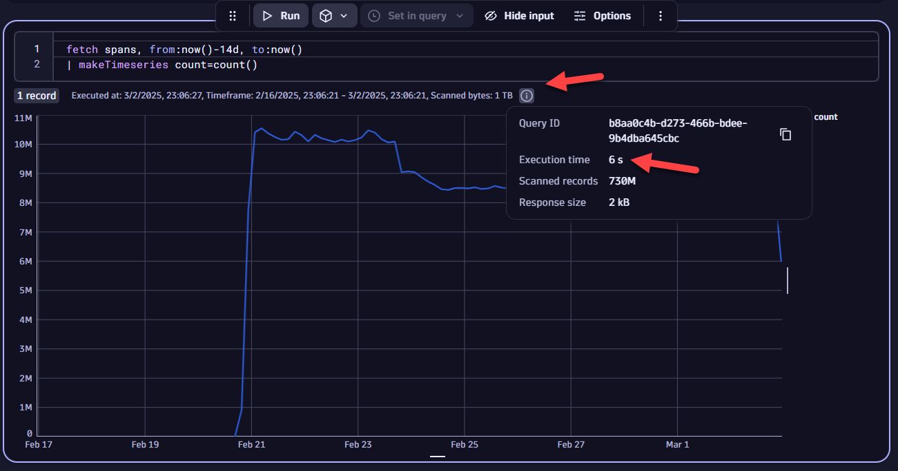
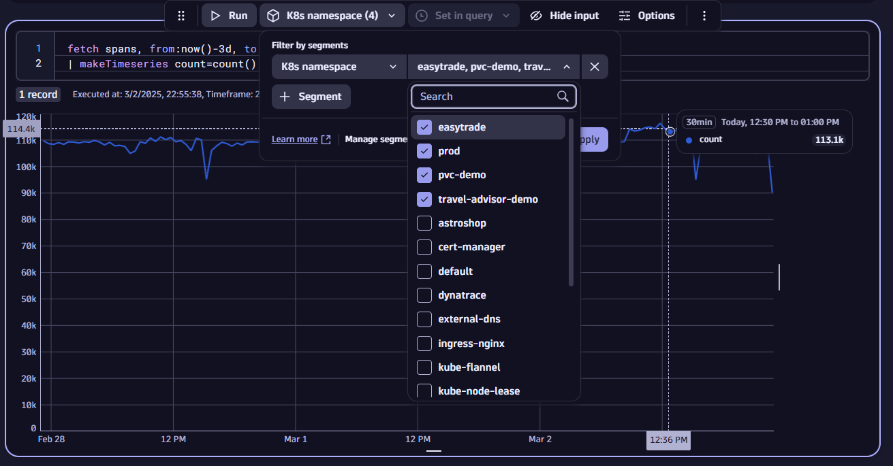
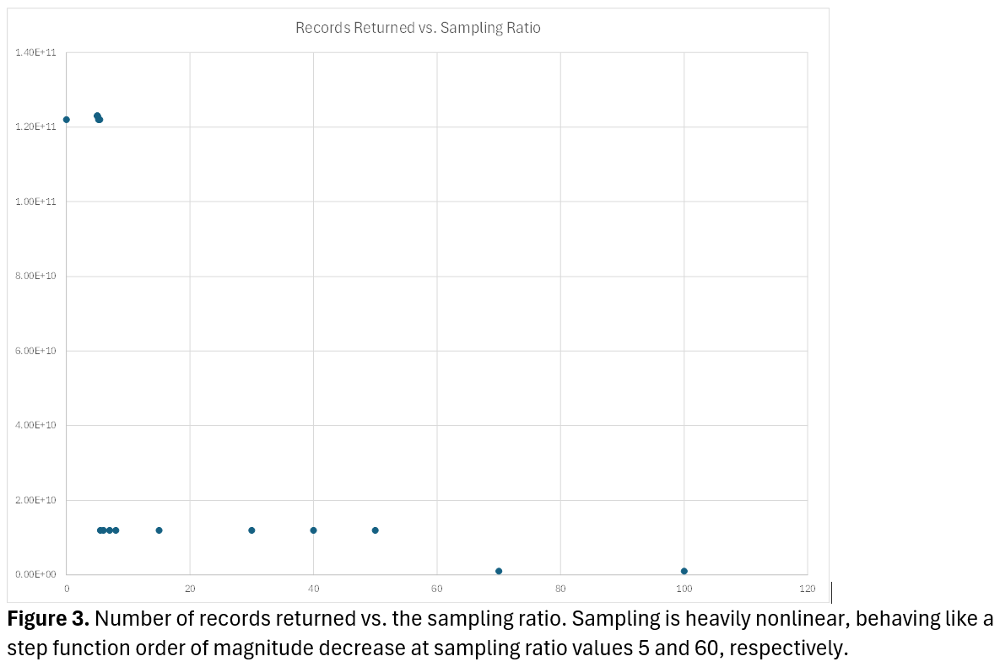

## Query Optimization

### Import Notebook into Dynatrace

[Notebook](https://github.com/popecruzdt/dt-k8s-otel-o11y-logs/blob/code-spaces/dt-k8s-otel-o11y-logs_dt_notebook.json)

### Why are my queries are poorly performing?
Whenever your query is executed against a large data volume in a single bucket, it will likely not perform well. In turn, you should have a systematic bucket strategy and utilize segments, as these are the highest priority filters when executing a DQL query. Put simply, filter early and often.

However, there are some query patterns that return large data amounts by definition, and therefore you should execute these queries with caution, as they potentially will not be performative:
* Log records past the default limit of 1000 records
* Queries with multiple `lookup` or `join` statements
* Trace and span data

As an example, take the following query:

```
fetch spans, from:now()-14d, to:now()
| makeTimeseries count=count()
```

That query looks to produce a request count timeseries over the last 2 weeks. By running it in a Notebook, you can note the execution time (shown below).



Typically, this query will run in ~5 s. If we apply some K8s namepsace segments - in this case, say `easyTrade`, `prod`, `pvc-demo`, and `travel-advisor-demo` - the query's performance improves to ~1 s. Since segments are applied as a priority filter, the performance gets better. This is crucial when placing queries on multiple tiles with variable filters in Dashboards; while some parallelization can occur on a Dashboard, this can become limited if the query is drawing from the same data source and/or bucket. 



In addition to the execution time, please note the number of scanned records and bytes before and after the application of the segment. Here, the number of scanned records remains constant, while the number of scanned bytes and execution time increases when the segment is removed. 

**⏩ Try it out**: Looking at the query performance before and after segment application, can you explain why the record count is unchanged? Is the retrieval time per record constant?

You may also notice that if you run a query for the first time and then run it again, the performance improves. Behind the scenes, there is query caching taking place. Depending on environment, you can see up to a *70% improvement in query execution time* for cached queries, but that number is heuristic, dependent on bucket utilization, query structure, data type, etc.

**⏩ Try it out**: Let's say we want to determine the log count coming from services in the last 24 hours. We know that we have logs spanning multiple AWS Availability Zones (AZs) in the `us-east` region. In turn, we want to be able to analyze logs coming from those AZs. Make a segment titled `AWS Availability Zones` that allows you to select a particular AZ for the log records. You likely will need to use `join` or `lookup` to do this (hint: see last example in the **Data Transformation** section). When you have that, run the query below, and note the performance before and after segment application.

Snippet:
```
fetch logs, from:now()-1d, to:now()
| lookup 
[
  fetch dt.entity.process_group_instance
  | fieldsAdd id
  | fieldsAdd entity.name
  | fieldsAdd services=runs[dt.entity.service]
  | expand serviceId=services
], sourceField: dt.source_entity, lookupField:id, prefix:"pgi."
| filter isNotNull(pgi.entity.name)
| lookup 
[
  fetch dt.entity.service
  | fieldsAdd id
  | fieldsAdd entity.name
], sourceField: pgi.serviceId, lookupField:id, prefix:"service."
| summarize count=count(), by:{service.entity.name}
```


### Improving Queries with `samplingRatio`
For DQL queries, we can use `samplingRatio` to randomly sample records from an initial `fetch` call. Depending on the specified value, a fraction (1/`samplingRatio`) of the available raw records is returned.

While any value less than or equal to 10000 can be used, the typical applicable value ranges for sampling are:
* 1: Default value, resulting in no applied sampling.
* 10
* 100
* 1000
* 10000

An example query with `samplingRatio` is given as follows:

```
fetch logs, from:now()-7d, to:now() samplingRatio:100
| summarize count = countIf(loglevel == "ERROR"), by:bin(timestamp, 3h)
| fieldsAdd count = count*100
```

Note that if you sample a query with counts, you should extrapolate the count to the order of magnitude used for `samplingRatio`. This is based on the fact that the the number of records returned after applying `samplingRatio` is non-linear, as seen in the figure below (sharding on the Grail data lakehouse backend). 



Certain queries - like request count and other simple DQL queries that do not need to split on a high-cardinality dimension - can perform well with sampling ratio. You can extrapolate the results so that the discarded counts or response time mimic the actual results. Sampling ratio does not affect the nominal retrieval time per record; that is dictated by the buckets used in the backend. 

If specific, potentially high cardinality dimensions are needed, then the sampling ratio likely cannot be used to improve performance. Specific records will likely be omitted at higher sampling ratio values. 

**⏩ Try it out**: Let's say we want to determine the log count coming from services in the last 24 hours. We know that we have logs spanning multiple AWS Availability Zones (AZs) in the `us-east` region. In turn, we want to be able to analyze logs coming from those AZs. Make a segment titled `AWS Availability Zones` that allows you to select a particular AZ for the log records. You likely will need to use `join` or `lookup` to do this (hint: see last example in the **Data Transformation** section). When you have that, run the query below, and note the performance before and after segment application.
### Enriching High Volume Data as Metrics


